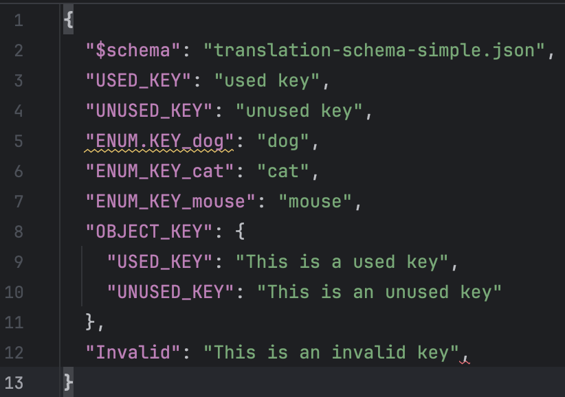

+++
title = 'Typed Translations in Angular'
date = 2024-06-15T14:10:31+02:00
draft = true
categories = ['Technology']
+++

# TL/DR
TBD

# Translations in Angular
i18n is important for making the page more accessible
accessability leads to easier usage and thus generates more traffic / usage
this is the reason why i18n is crucial for a modern anuglar app

# Translation Management sucks
Translation files are jsons which do not enforce a format of the keys or the json stucture by design. Free growth of these translation files can lead to quite a mess. With each addition of a key every developer has to think of an expressive name and also ensure that the readability of the file is not reduced

The easiest way to align the expressiveness and structure of the translation files within the developer team is to settle on a guideline.

* a simple guideline is good but it has to be reviewed -> cannot be automatically reviewed -> mistakes / waste of developer time

* additionally, software changes -> lot of unused keys 

* finally the keys are not type-safe which can introduce typos in the transalted language files or when used in the code

Example
```json {file="example-translation.json"}
{
  "USED_KEY": "used key",
  "ENUM.KEY_dog": "wrong format (. instead of _)",
  "ENUM_KEY_cat": "cat",
  "ENUM_KEY_mouse": "mouse",
  "OBJECT_KEY": {
    "USED_KEY": "This is a used key",
    "UNUSED_KEY": "This key is not used"
  },
  "^'23vv.vad": "This key is in a unwanted format"
}
```

=> The introduction of a type-safe format which enforces the team guidelines and is automatically tested could be one less thing to mind about while developing software

# Possible Solutions

First focus on typing / validating translation files, then integration in angular, 

## Typing Translation files
### JSON Schema File
One way to make json fiels type-safe is to validate it by a predefined schema. [JSONSchema](https://json-schema.org/specification) provides the possibilty to define the desired json's structure by custom schema definitions.
These custom schemas then can be validated against your translation files in your pipeline or directly in your IDE.
Intellij and VS Code both support the validation of json schemas:
* https://www.jetbrains.com/help/idea/json.html#ws_json_schema_add_custom
* https://code.visualstudio.com/docs/languages/json#_json-schemas-and-settings


For example to validate the json from the top we could specify the following 


```json {file="json-schema-full.json"}
{
  "$schema": "https://json-schema.org/draft/2020-12/schema",
  "type": "object",
  "properties": {
    "$schema": {
      "type": "string"
    },
    "USED_KEY": {
      "type": "string"
    },
    "ENUM_KEY_dog": {
      "type": "string"
    },
    "ENUM_KEY_cat": {
      "type": "string"
    },
    "ENUM_KEY_mouse": {
      "type": "string"
    },
    "OBJECT_KEY": {
      "type": "object",
      "properties": {
        "USED_KEY": {
          "type": "string"
        },
      },
      "required": [
        "USED_KEY"
      ],
      "additionalProperties": false
    }
  },
  "required": [
    "$schema",
    "USED_KEY",
    "ENUM_KEY_dog",
    "ENUM_KEY_cat",
    "ENUM_KEY_mouse",
    "OBJECT_KEY" 
  ],
  "additionalProperties": false
}
```


When referencing the schema by a '$schema' key Intellij automatically validates it against the json file. If some rule fails you get syntax highlighting in the editor:


These full schema validations provide a good way to ensure that all defined keys are represented in all translation files. The downside of this approach is that the schema file is yet another file to maintain plus we cannot reference the translation keys in a type-safe way. So this can only be a partial solution.

### Simple JSON Schema Validation
JSON Schemas can be useful tough. If you agreed on a naming pattern which should be respected by all translation keys then you could write a small schema file which states this pattern written in RegEx:

```json {file="json-schema-simple.json"}
{
  "$schema": "https://json-schema.org/draft/2020-12/schema",
  "type": "object",
  "propertyNames": {
    "pattern": "^\\$schema|([A-Za-z_]+)$"
  }
}
```


As for the full schema your Intellij will validate this schema automatically:




Unfortunately this property name pattern does not work in VSCode atm.


### Translation Files written in Typescript?
As we saw we cannot use JSON Schema to check the integrity of the translation files as well using the keys in a type-safe manner.


 ```typescript {file="adsf"}
// i18n/en.ts
export default {
  "USED_KEY": "used key",
  "UNUSED_KEY": "unused key",
  "ENUM_KEY_dog": "dog",
  "ENUM_KEY_cat": "cat",
  "ENUM_KEY_mouse": "mouse",
  "OBJECT_KEY": {
    "USED_KEY": "This is a used key",
    "UNUSED_KEY": "This is an unused key"
  },
}

// i18n/de.ts
import en from "./en";

export default {
  "USED_KEY": "Das ist ein gebrauchter Schlüssel",
  "UNUSED_KEY": "Das ist ein unbenutzter Schlüssel",
  "ENUM_KEY_dog": "Hund",
  "ENUM_KEY_cat": "Katze",
  "ENUM_KEY_mouse": "Maus",
  "OBJECT_KEY": {
    "USED_KEY": "Das ist ein gebrauchter Schlüssel",
    "UNUSED_KEY": "Das ist ein unbenutzter Schlüssel"
  }
} as typeof en;
```

Big plus: ensures that all transaltions files have all keys


## Adoption in Angular

We have to get a 


### Typing

 ```typescript {file="adsf"}
// translation-key.type.ts
import {RecursiveKey} from "./recursive-key";

type TranslationFile = {
    'USED_KEY': string;
    'ENUM_KEY_cat': string;
    'ENUM_KEY_dog': string;
    'ENUM_KEY_mouse': string;
    'OBJECT_KEY': {
        USED_KEY: string;
        UNUSED_KEY: string;
    }
}

export type TranslationKey = RecursiveKey<TranslationFile>;


// utils/recursive-key.type.ts
export type RecursiveKey<TObj extends object> = {
    [TKey in keyof TObj & (string | number)]: RecursiveKeyOfHandleValue<TObj[TKey], `${TKey}`>;
}[keyof TObj & (string | number)];

type RecursiveKeyOfInner<TObj extends object> = {
    [TKey in keyof TObj & (string | number)]: RecursiveKeyOfHandleValue<TObj[TKey], `['${TKey}']` | `.${TKey}`>;
}[keyof TObj & (string | number)];

type RecursiveKeyOfHandleValue<TValue, Text extends string> = TValue extends unknown[]
    ? Text
    : TValue extends object
        ? Text | `${Text}${RecursiveKeyOfInner<TValue>}`
        : Text;

```

### Typed Pipe

 ```typescript {file="adsf"}
@Pipe({
    name: 'typedTranslate',
    standalone: true,
    pure: false
})
export class TypedTranslatePipe extends TranslatePipe {
    constructor(translate: TranslateService, _ref: ChangeDetectorRef) {
        super(translate, _ref);
    }

    override transform(key: TranslationKey, ...args: any[]): any {
        return super.transform(key, ...args);
    }
}
```

### Test Component
 ```typescript {file="adsf"}
@Component({
  selector: 'app-root',
  standalone: true,
  imports: [RouterOutlet, TranslateModule, NgForOf, TypedTranslatePipe],
  template: `
    <h1>Welcome to {{title}}!</h1>

    <p>{{ 'USED_KEY' | typedTranslate }}</p>
    <ul>
      <li *ngFor="let animal of animals">{{ getAnimalKey(animal) | typedTranslate }}</li>
    </ul>
    
    {{ 'ENUM_KEY_cat' | typedTranslate }}
    <router-outlet />
  `,
  styles: [],
})
export class AppComponent {
  title = 'translation-key-finder';
  // animals: Animals[] = [Animals.CAT, Animals.DOG, Animals.MOUSE];
  animals: Animals[] = [Animals.CAT, Animals.MOUSE];

  getAnimalKey(animal: Animals): TranslationKey {
    return <const>`ENUM_KEY_${animal}`;
  }
}
```

## Other Frameworks
react, vuejs, vite?

# Conclusion
Simple json schema approach feels like a quick-win which is not as intrusive as writing translations in typescript
                                                                                                      
