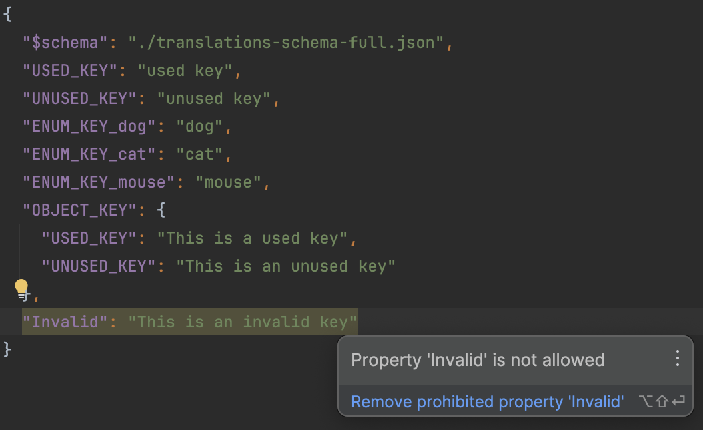

+++
title = 'Typed Translations in Angular'
date = 2024-06-15T14:10:31+02:00
draft = true
categories = ['Technology']
+++

Structure
* TL/DR
* Foreword (General -> Accessability -> Translations)
* Current Problem
    * untyped => typos
    * incomplete / bloated translation files
    * easy of use
* Solution approach
    * typed translation files
        * JSON Schema File => high maintenance, low revenue
        * Simple JSON Schema Validation => Simple plug-in approach
        * Translation Files written in Typescript
    * adoption in angular
        * ngx-translate: override translation pipe
    * other web frameworks?
      react, vuejs, vite?

# TL/DR
TBD

# Translations in Angular
i18n is important for making the page more accessible
accessability leads to easier usage and thus generates more traffic / usage
this is the reason why i18n is crucial for a modern anuglar app

# Translation Management sucks
Translation files are jsons which do not enforce a format of the keys or the json stucture by design. Free growth of these translation files can lead to quite a mess. With each addition of a key every developer has to think of an expressive name and also ensure that the readability of the file is not reduced

The easiest way to align the expressiveness and structure of the translation files within the developer team is to settle on a guideline.

* a simple guideline is good but it has to be reviewed -> cannot be automatically reviewed -> mistakes / waste of developer time

* additionally, software changes -> lot of unused keys 

* finally the keys are not type-safe which can introduce typos in the transalted language files or when used in the code

=> The introduction of a type-safe format which enforces the team guidelines and is automatically tested could be one less thing to mind about while developing software

# Possible Solutions

First focus on typing / validating translation files, then integration in angular, 

## Typing Translation files
### JSON Schema File
Downside: High maintenance of the schema  
Upside: Validate if all translation files have the same sync

```json
{
  "$schema": "https://json-schema.org/draft/2020-12/schema",
  "type": "object",
  "properties": {
    "$schema": {
      "type": "string"
    },
    "USED_KEY": {
      "type": "string"
    },
    "UNUSED_KEY": {
      "type": "string"
    },
    "ENUM_KEY_dog": {
      "type": "string"
    },
    "ENUM_KEY_cat": {
      "type": "string"
    },
    "ENUM_KEY_mouse": {
      "type": "string"
    },
    "OBJECT_KEY": {
      "type": "object",
      "properties": {
        "USED_KEY": {
          "type": "string"
        },
        "UNUSED_KEY": {
          "type": "string"
        }
      },
      "required": [
        "USED_KEY",
        "UNUSED_KEY"
      ],
      "additionalProperties": false
    }
  },
  "required": [
    "$schema",
    "USED_KEY",
    "ENUM_KEY_dog",
    "ENUM_KEY_cat",
    "ENUM_KEY_mouse",
    "OBJECT_KEY"
  ],
  "additionalProperties": false
}
```




### Simple JSON Schema Validation
```json
{
  "$schema": "https://json-schema.org/draft/2020-12/schema",
  "type": "object",
  "propertyNames": {
    "pattern": "^\\$schema|([A-Za-z_]+)$"
  }
}
```


### Translation Files written in Typescript?
```typescript
// i18n/en.ts
export default {
  "USED_KEY": "used key",
  "UNUSED_KEY": "unused key",
  "ENUM_KEY_dog": "dog",
  "ENUM_KEY_cat": "cat",
  "ENUM_KEY_mouse": "mouse",
  "OBJECT_KEY": {
    "USED_KEY": "This is a used key",
    "UNUSED_KEY": "This is an unused key"
  },
}

// i18n/de.ts
import en from "./en";

export default {
  "USED_KEY": "Das ist ein gebrauchter Schlüssel",
  "UNUSED_KEY": "Das ist ein unbenutzter Schlüssel",
  "ENUM_KEY_dog": "Hund",
  "ENUM_KEY_cat": "Katze",
  "ENUM_KEY_mouse": "Maus",
  "OBJECT_KEY": {
    "USED_KEY": "Das ist ein gebrauchter Schlüssel",
    "UNUSED_KEY": "Das ist ein unbenutzter Schlüssel"
  }
} as typeof en;
```

Big plus: ensures that all transaltions files have all keys


## Adoption in Angular

We have to get a 


### Types

```typescript
// translation-key.type.ts
import {RecursiveKey} from "./recursive-key";

type TranslationFile = {
    'USED_KEY': string;
    'ENUM_KEY_cat': string;
    'ENUM_KEY_dog': string;
    'ENUM_KEY_mouse': string;
    'OBJECT_KEY': {
        USED_KEY: string;
        UNUSED_KEY: string;
    }
}

export type TranslationKey = RecursiveKey<TranslationFile>;


// utils/recursive-key.type.ts
export type RecursiveKey<TObj extends object> = {
    [TKey in keyof TObj & (string | number)]: RecursiveKeyOfHandleValue<TObj[TKey], `${TKey}`>;
}[keyof TObj & (string | number)];

type RecursiveKeyOfInner<TObj extends object> = {
    [TKey in keyof TObj & (string | number)]: RecursiveKeyOfHandleValue<TObj[TKey], `['${TKey}']` | `.${TKey}`>;
}[keyof TObj & (string | number)];

type RecursiveKeyOfHandleValue<TValue, Text extends string> = TValue extends unknown[]
    ? Text
    : TValue extends object
        ? Text | `${Text}${RecursiveKeyOfInner<TValue>}`
        : Text;

```

### Typed Pipe

```typescript
@Pipe({
    name: 'typedTranslate',
    standalone: true,
    pure: false
})
export class TypedTranslatePipe extends TranslatePipe {
    constructor(translate: TranslateService, _ref: ChangeDetectorRef) {
        super(translate, _ref);
    }

    override transform(key: TranslationKey, ...args: any[]): any {
        return super.transform(key, ...args);
    }
}
```

### Test Component
```typescript
@Component({
  selector: 'app-root',
  standalone: true,
  imports: [RouterOutlet, TranslateModule, NgForOf, TypedTranslatePipe],
  template: `
    <h1>Welcome to {{title}}!</h1>

    <p>{{ 'USED_KEY' | typedTranslate }}</p>
    <ul>
      <li *ngFor="let animal of animals">{{ getAnimalKey(animal) | typedTranslate }}</li>
    </ul>
    
    {{ 'ENUM_KEY_cat' | typedTranslate }}
    <router-outlet />
  `,
  styles: [],
})
export class AppComponent {
  title = 'translation-key-finder';
  // animals: Animals[] = [Animals.CAT, Animals.DOG, Animals.MOUSE];
  animals: Animals[] = [Animals.CAT, Animals.MOUSE];

  getAnimalKey(animal: Animals): TranslationKey {
    return <const>`ENUM_KEY_${animal}`;
  }
}
```

## Other Frameworks
react, vuejs, vite?

# Conclusion
Simple json schema approach feels like a quick-win which is not as intrusive as writing translations in typescript
                                                                                                      
