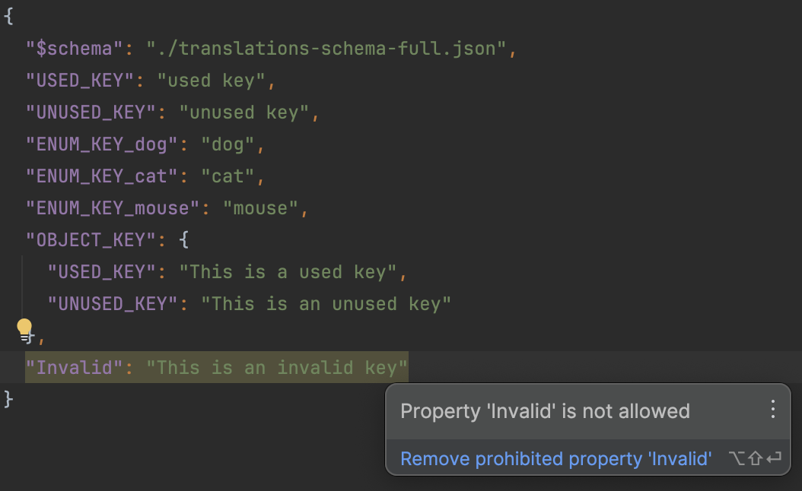
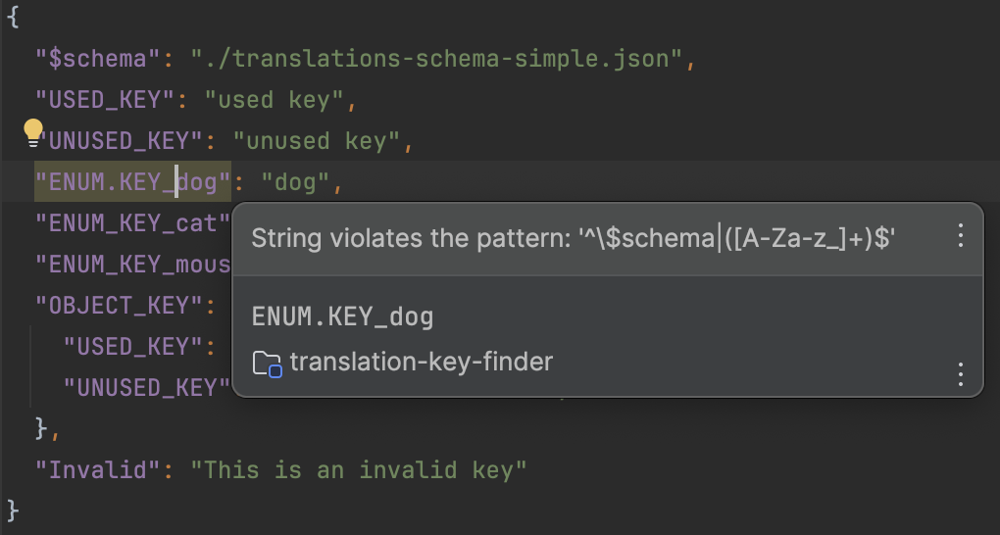

+++
title = 'Typed Translations in Angular'
date = 2025-01-29T19:00:00+01:00
draft = false
version = 1
author = 'Colin'
categories = ['Angular', 'accessability', 'ngx-translate']
+++


# TL/DR
* Quick-Win: Create a Json Schema file to validate the format of translation keys
* Big / customer facing projects: Write translations in TypeScript files and define a Type based on it. Use this Type to ensure that keys in your App actually exist.

# Why translate?
A lot of web applications are  exposed to a target audience which likely consists of people who speak different languages. You can make your application easier to use if you translate it's content (e.g. buttons, navigation, links, headers, etc.).


# Maintaining translation files is a pain
Translations are typically managed through json files where one or more files are created for each language you want to support (e.g. en.json, de.json). The problem of a basic json file is that it does not enforce a format of the keys or the stucture of the data by design. Due to that uncontrolled growth of these translation files can lead to quite a mess. With each added key every developer has to think of an expressive name and also ensure that the readability of the file is not worsened.

To reduce the effort a team can settle on dev guidelines to align the expressiveness and structure of the translation files.

Team Guidlines are the basis to untangle the mess with translation files but they have some crucial challenges:

* a guideline is good but it has to be reviewed continuously to prevent mistakes 

* software always changes. this can lead to unused keys 

* keys are not type-safe which can introduce typos between language files or when used in code

The following example showcases typical problems in translation file 
```json {file="example-translation.json"}
{
  "USED_KEY": "used key",
  "ENUM.KEY_dog": "wrong format (. instead of _)",
  "ENUM_KEY_cat": "cat",
  "ENUM_KEY_mouse": "mouse",
  "OBJECT_KEY": {
    "USED_KEY": "This is a used key",
    "UNUSED_KEY": "This key is not used"
  },
  "^bad~char": "This key is in a unwanted format / with unwanted symbols"
}
```

# Goal
I want to tackle the difficulties of translation files by evaluating and adopting some type-safe approach. A type-safe format could enforce team guidelines by automatic testing. Which makes translation files one less thing to mind about while developing software.


# Possible solutions

First, I will explore three approaches to making the translation files themselves more type-safe. Then, we will look at how to make translation keys in our application's code safer and easier to use.

## Enforcing guidelines on translation files
### JSON Schema file
One way to make json files type-safe is to validate it by a predefined schema. [JSONSchema](https://json-schema.org/specification) provides the possibilty to define the desired json's structure by custom schema definitions.
These custom schemas then can be validated against your translation files in your pipeline or directly in your IDE.
Intellij and VS Code both support the validation of json schemas:
* https://www.jetbrains.com/help/idea/json.html#ws_json_schema_add_custom
* https://code.visualstudio.com/docs/languages/json#_json-schemas-and-settings


For example to validate the json from the top we could specify the following 


```json {file="json-schema-full.json"}
{
  "$schema": "https://json-schema.org/draft/2020-12/schema",
  "type": "object",
  "properties": {
    "$schema": {
      "type": "string"
    },
    "USED_KEY": {
      "type": "string"
    },
    "ENUM_KEY_dog": {
      "type": "string"
    },
    "ENUM_KEY_cat": {
      "type": "string"
    },
    "ENUM_KEY_mouse": {
      "type": "string"
    },
    "OBJECT_KEY": {
      "type": "object",
      "properties": {
        "USED_KEY": {
          "type": "string"
        },
      },
      "required": [
        "USED_KEY"
      ],
      "additionalProperties": false
    }
  },
  "required": [
    "$schema",
    "USED_KEY",
    "ENUM_KEY_dog",
    "ENUM_KEY_cat",
    "ENUM_KEY_mouse",
    "OBJECT_KEY" 
  ],
  "additionalProperties": false
}
```


When referencing the schema by a '$schema' key Intellij automatically validates it against the json file. If a rule fails you get syntax highlighting in the editor:


These full schema validations provide a good way to ensure that all defined keys are represented in all translation files and there is no spelling mistake. The downside of this approach is that the schema file is yet another file to maintain plus we cannot reference the translation keys in code in a type-safe way. So this can only be a partial solution.

### Simple JSON Schema validation
JSON Schemas can be useful tough. If your team agreed on a naming pattern which all translation keys should respect then you could write a small schema file which states this pattern written in RegEx:

```json {file="json-schema-simple.json"}
{
  "$schema": "https://json-schema.org/draft/2020-12/schema",
  "type": "object",
  "propertyNames": {
    "pattern": "^\\$schema|([A-Za-z_]+)$"
  }
}
```


Like the full schema your Intellij will validate this schema automatically:




Unfortunately this property name pattern does not work in VSCode atm.


### Translation files written in TypeScript?
As we saw JSON Schema can be used to check the integrity of the translation files. But if we want to ensure that the keys are referenced in a type-safe manner we have to get a bit more creative.

Since the source code is mainly written in TypeScript and - as the name implies- one big feature of the language is to enforce a type system to our code we can use its magic to check our translation files too.

There would be multiple ways to get this working. I've settled on the following approach:
 ```TypeScript {file="i18n/en.ts"}
// i18n/en.ts
export default {
  "USED_KEY": "used key",
  "UNUSED_KEY": "unused key",
  "ENUM_KEY_dog": "dog",
  "ENUM_KEY_cat": "cat",
  "ENUM_KEY_mouse": "mouse",
  "OBJECT_KEY": {
    "USED_KEY": "This is a used key",
    "UNUSED_KEY": "This is an unused key"
  },
}

// i18n/de.ts
import en from "./en";

export default {
  "USED_KEY": "Das ist ein gebrauchter Schlüssel",
  "UNUSED_KEY": "Das ist ein unbenutzter Schlüssel",
  "ENUM_KEY_dog": "Hund",
  "ENUM_KEY_cat": "Katze",
  "ENUM_KEY_mouse": "Maus",
  "OBJECT_KEY": {
    "USED_KEY": "Das ist ein gebrauchter Schlüssel",
    "UNUSED_KEY": "Das ist ein unbenutzter Schlüssel"
  }
} as typeof en;
```

For each language (e.g. English and German) I created a separate TypeScript file. Each translation file consists just of a default export which exports all translation of the respective language as an object. Now to get the type-checking working we let the compiler know against which Type we want to check. This is done by adding `as typeof en` to the end of the German translations. 

What I like about this setup is that it does not just check if the keys are spelled correctly. It also checks that there are no missed or additional keys. 

But how could you use this in your Angular project? 


## Adoption in Angular (using ngx-translate)

### Typing
The first step is to get our translation Type actually usable. Because ngx-translate takes the refence as a dot-separated path which it is using to travers the translation object:
```TypeScript {file="example.component.html"}
<p>{{ "USED_KEY" | translate }}</p>
<p>{{ "OBJECT_KEY.USED_KEY" | translate }}</p>
<p>{{ "USED_KEY" | translate }}</p>
```

To map our existing translation file Type into the desired format we have to use a small helper:
```TypeScript {file="recursive-key.ts"}
export type RecursiveKeyType<TObj extends object> = {
  [TKey in keyof TObj & (string | number)]: RecursiveKeyOfHandleValue<
    TObj[TKey],
    `${TKey}`
  >;
}[keyof TObj & (string | number)];

type RecursiveKeyOfInner<TObj extends object> = {
  [TKey in keyof TObj & (string | number)]: RecursiveKeyOfHandleValue<
    TObj[TKey],
    `.${TKey}`
  >;
}[keyof TObj & (string | number)];

type RecursiveKeyOfHandleValue<
  TValue,
  Text extends string,
> = TValue extends unknown[]
  ? Text
  : TValue extends object
    ? Text | `${Text}${RecursiveKeyOfInner<TValue>}`
    : Text;
```

Let's not go deep on this abomination of a Type. Maybe another time. But what it does is quite cool. It flattens an object into a union Type of its hierarchy. Each key in the hierarchy is expressed through a dot-separated string from the root of the object. So from a object that looks like this: `{foo:{bar:{tar:''}}}` the `RecursiveKey` Type will produce a union Type like this `'foo' | 'foo.bar' | 'foo.bar.tar'`.

Looks quite like what we're looking for, right? With this helper we can declare a new Type in our application which ensures that each translation reference actually matches a translation in the translation file. This new Type can simply declared like this:

 ```TypeScript {file="translation-key.type.ts"}
import { RecursiveKeyType } from "./recursive-key.type";
import en from "../../../i18n/en";

export type TranslationKey = RecursiveKeyType<typeof en>;
```

### Typed Pipe
Unfortunately, ngx-translate does not provide the possiblity to enable type-safe usage of translation keys out of the box. So we have to do it by ourselves. For that we create a new Pipe which extends ngx-translate's `TranslatePipe`. Then, we simply override the `transform` function to only accept keys of the TranslationKey Type:

 ```TypeScript {file="typed-translate.pipe.ts"}
@Pipe({
    name: 'typedTranslate',
    standalone: true,
    pure: false
})
export class TypedTranslatePipe extends TranslatePipe {
    constructor(translate: TranslateService, _ref: ChangeDetectorRef) {
        super(translate, _ref);
    }

    override transform(key: TranslationKey, ...args: any[]): any {
        return super.transform(key, ...args);
    }
}
```

### Usage

The custom `TypedTranslatePipe` can then be used like the regular `TranslateType`:
 ```TypeScript {file="app.component.ts"}
@Component({
  selector: 'app-root',
  standalone: true,
  imports: [RouterOutlet, TranslateModule, NgForOf, TypedTranslatePipe],
  template: `
    <p>{{ 'USED_KEY' | typedTranslate }}</p>
    <ul>
      <li *ngFor="let animal of animals">{{ getAnimalKey(animal) | typedTranslate }}</li>
    </ul>
    
    {{ 'ENUM_KEY_cat' | typedTranslate }}
  `,
  styles: [],
})
export class AppComponent {
  animals: Animals[] = [Animals.CAT, Animals.MOUSE];

  getAnimalKey(animal: Animals): TranslationKey {
    return <const>`ENUM_KEY_${animal}`;
  }
}
```

# My Conclusion
To conclude, Team guidelines would be the first thing to establish in the team. With that we have the basis to apply reasonable and automatic checks. Then, creating a simple json schema which checks the key's format feels like a quick-win. It is not as intrusive as writing translations in TypeScript but can still lead to noticable improvements.

Introducing types for translations could be beneficial, especially for projects with extensive translations or when ensuring that all keys reference a valid translation. This is particularly useful in customer-facing applications.

Would you use TypeScript Typings for your translations? [Let me know](mailto:colin@cln.dev)</a>

                                                                                                      
